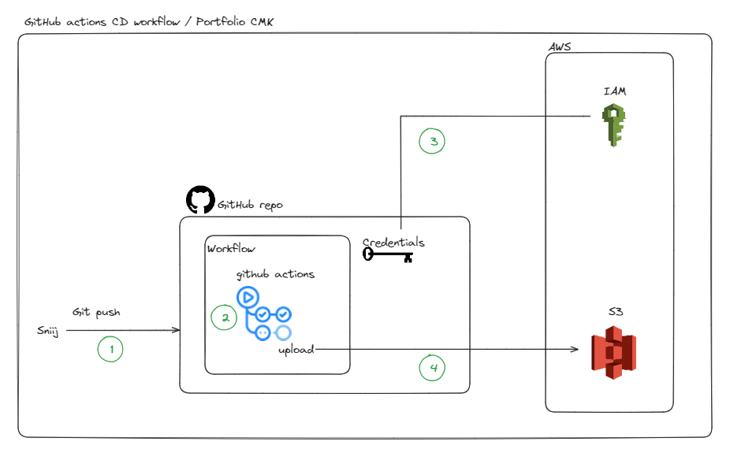

# Portfolio 용도로 제작한 웹입니다.
##### 기본적인 템플릿은 https://html5up.net/massively 에서 가져왔습니다.
---

#### Architecture

</img>

---
##### Deployment URL: https://www.chomanki.com

- OVERVIEW, PORTFOLIO 스타일 컴포넌트 설정
- PORTFOLIO 별 모달창 직접 구현 + 태그값 지정
- AWS ( S3, CloudFront, Route 53) service 를 사용하여 웹 페이지 배포
- Github actions 를 통해 자동 배포 구성
- Google Analytics API 를 이용하여 웹페이지 방문자 수를 계산하는 API 개발
- AWS Lambda 에서 위의 API 를 실행시키고 API Gateway 를 통해 Serverless 시스템 구축
